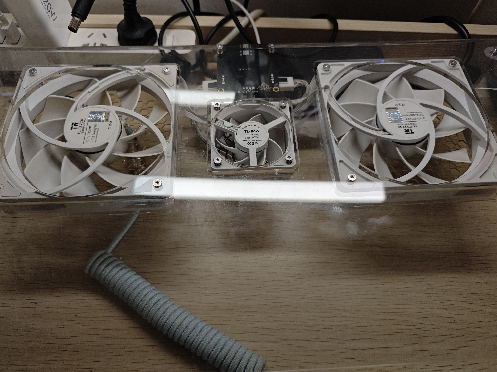
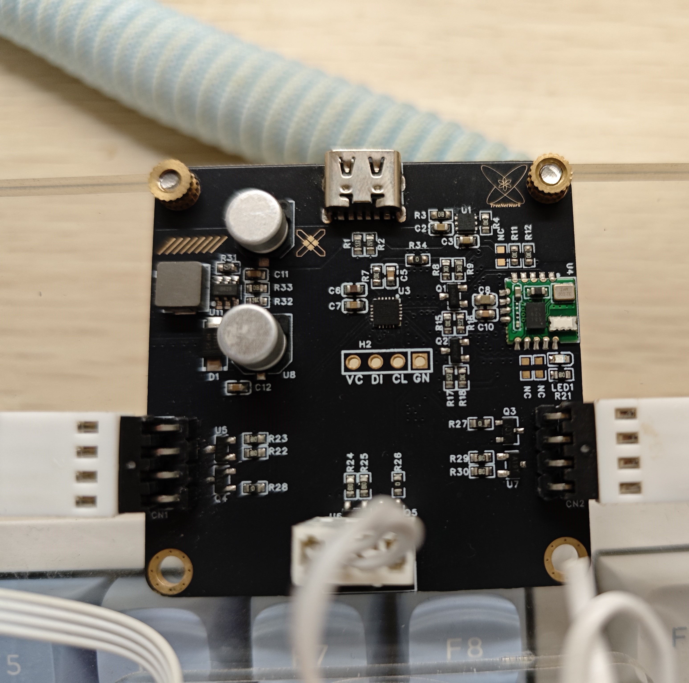

# 智能散热小桌板 / TemperatureControlV3

[](LICENSE.txt)
[](https://github.com/Ankali-Aylina/IRSTB/actions)

简单说就是能根据电脑温度自动调节风扇转速的散热小桌板。

## 功能特点

- 实时监测 CPU / GPU 温度（Intel + AMD + NVIDIA）
- 根据温度自动调节风扇转速
- 蓝牙 BLE 连接（DX-BT24-T 模块）
- 开机自启、最小化托盘
- 现代化深色 UI 界面
- PawnIO / AMDRyzenMaster 双驱动支持

## 硬件设计

| 组件     | 型号                    |
| -------- | ----------------------- |
| 主控芯片 | CW32L010                |
| 蓝牙模块 | DX-BT24-T               |
| 风扇     | 12V 直流（利民 TL-C12） |

## 成品展示




---

## 系统要求（TCV3 上位机）

| 要求     | 说明                                                            |
| -------- | --------------------------------------------------------------- |
| 操作系统 | Windows 10/11 64-bit                                            |
| 运行时   | [VC Redist x64](https://aka.ms/vs/17/release/vc_redist.x64.exe) |
| CPU      | Intel (需 PawnIO 驱动) / AMD (需 AMDRyzenMaster 驱动)           |
| GPU      | NVIDIA (nv_dll)                                                 |

## 快速开始

### 下载安装

1. 前往 [Releases](https://github.com/Ankali-Aylina/IRSTB/releases) 下载最新安装包
2. 运行 `TemperatureControlV3_vX.X.X.X_Setup.exe`
3. 首次启动会自动提示安装所需驱动
4. 连接蓝牙设备后即可使用

### 本地构建

```powershell
# 环境要求：Visual Studio 2022 + Qt 6.11.1 msvc2022_64 + Inno Setup 7

# 一键编译+打包
.\package.ps1

# 跳过编译直接打包（需已构建 Release）
.\package.ps1 -SkipBuild

# 编译安装包
& "C:\Program Files (x86)\Inno Setup 7\ISCC.exe" installer.iss
```

## 项目结构

```
TemperatureControlV3/
├── ApplicationBootstrap    # 启动引导（UAC 提权、资源提取、驱动检测）
├── TCV3                    # 主窗口 + UI 逻辑
├── TCCore                  # 温度采集 + 风扇控制（独立线程）
├── BLEThread               # 蓝牙 LE 通信（独立线程）
├── AppModuleManager        # 模块生命周期管理
├── ResourceExtractor       # 从 QRC 提取运行时资源到 %TEMP%
├── NativeLibraryLoader     # DLL 加载封装
├── PawnIoDriverManager     # PawnIO 驱动检测与安装
├── IniManagement            # INI 配置读写（QSettings）
├── LogManagement           # 日志管理（全局单例）
├── installer.iss           # Inno Setup 安装脚本
├── package.ps1             # 一键打包脚本
└── res/                    # 资源文件（DLL、驱动、图标）
```

## 技术栈

| 技术          | 版本                                             |
| ------------- | ------------------------------------------------ |
| C++           | 20                                               |
| Qt            | 6.11.1 (Core/Gui/Widgets/Concurrent/Network/Svg) |
| Visual Studio | 2022 (v145, MSVC)                                |
| Inno Setup    | 7.x                                              |
| 驱动          | PawnIO / AMDRyzenMasterV27                       |

## 更新日志

参见 [res/updatalog.md](res/updatalog.md) 或程序内更新日志页面。

| 版本         | 主要变更                                                    |
| ------------ | ----------------------------------------------------------- |
| **v3.4.0.1** | 安装器更新机制，修复恢复默认设置 Bug（竞态条件 + 开机自启） |
| **v3.4.0.0** | 修复大量 bug，更换 Intel 温度读取驱动，更新 UI              |
| v3.3.2.x     | UI 优化、设备检测优化、更新日志页面                         |
| v3.3.0.0     | BLE 蓝牙库重构，轻量化运行                                  |
| v3.2.0.0     | 添加 AMD 驱动兼容                                           |
| v3.1.0.0     | 移除 LibreHardwareMonitor，添加 CPU 类型识别                |
| v3.0.0.0     | 重构为 Qt6 框架                                             |
| v2.0.0.0     | C# 重构，LibreHardwareMonitor 集成                          |
| v1.0.0.0     | 命令行基础控制                                              |

## 贡献者

| 贡献者                                            | 角色                            |
| ------------------------------------------------- | ------------------------------- |
| [Ankali-Aylina](https://github.com/Ankali-Aylina) | 项目作者，全栈开发              |
| [DeepSeek V4 Pro](https://chat.deepseek.com)      | AI 编程助手，代码生成与问题诊断 |

## 许可证

本项目代码使用 [MIT License](LICENSE.txt)。

本软件使用 [Qt](https://www.qt.io/) 框架，Qt 库文件以 LGPLv3 许可证动态链接分发。
Qt 源码可从 https://www.qt.io/download-open-source 获取。
用户有权自行替换本软件附带的 Qt 库文件（Qt6Core.dll、Qt6Gui.dll 等）。
