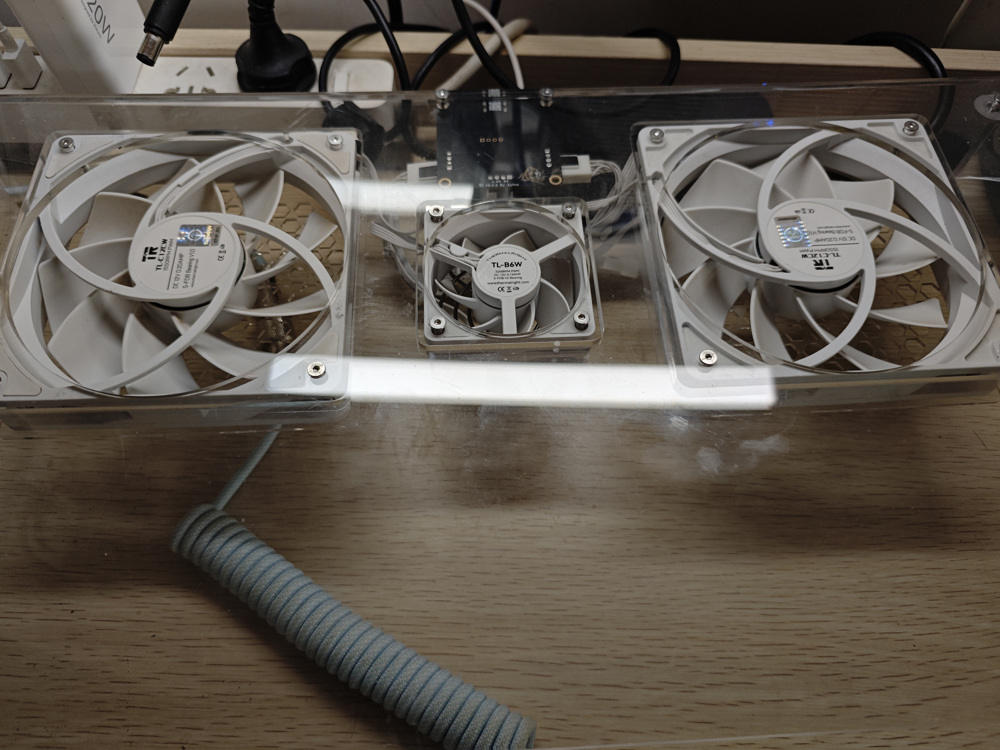
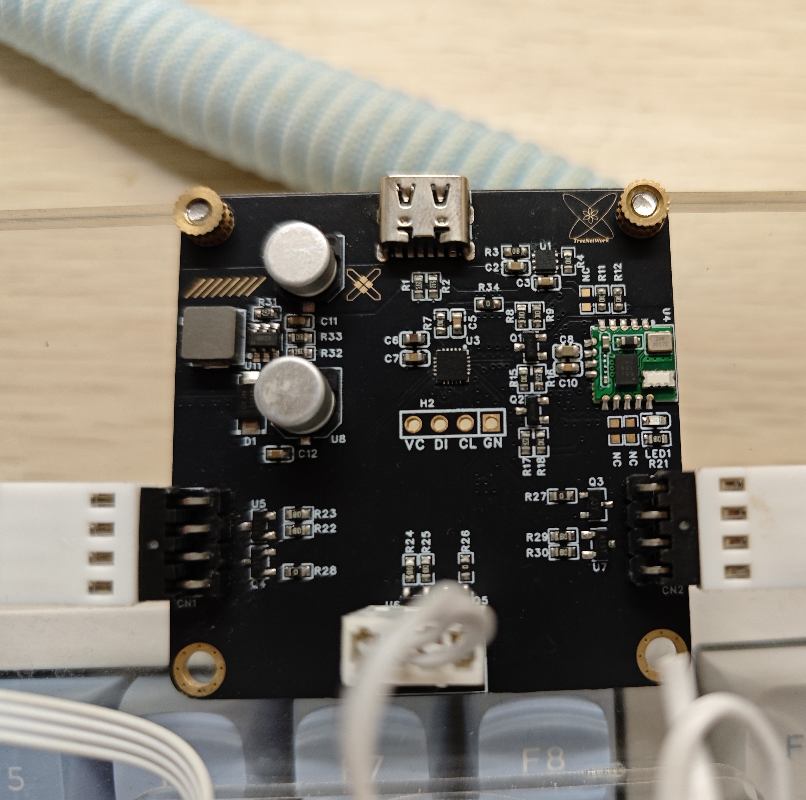

# 智能散热小桌板 / TemperatureControlV3

[](LICENSE.txt)
[](https://github.com/Ankali-Aylina/IRSTB/actions)

简单说就是能根据电脑温度自动调节风扇转速的散热小桌板。

## 功能特点

- 现代化 WinUI 风格界面（Qt Quick / QML 重写）
- Windows 11 云母 (Mica) / 亚克力 (Acrylic) 背景材质
- 浅色 / 深色双主题：支持跟随系统或手动切换，图标随主题自动着色
- 实时监测 CPU / GPU 温度（Intel + AMD + NVIDIA）
- 根据温度自动调节风扇转速
- **关机散热**：一键让风扇满速运转设定时长后自动断电；倒计时由下位机独立完成，期间蓝牙断开、退出程序、关闭电脑都不中断，结束后自动切回自动模式
- **系统通知**：散热结束或指令下发失败时在右下角提醒（窗口最小化到托盘也可见），可在设置中开关
- 蓝牙 BLE 连接（DX-BT24-T 模块，基于 WinRT BLE API）
- 开机自启、最小化托盘
- PawnIO / AMDRyzenMaster 双驱动支持

## 硬件设计

| 组件     | 型号                    |
| -------- | ----------------------- |
| 主控芯片 | CW32L010                |
| 蓝牙模块 | DX-BT24-T               |
| 风扇     | 12V 直流（利民 TL-C12） |

## 成品展示




---

## 系统要求（TCV3 上位机）

| 要求     | 说明                                                            |
| -------- | --------------------------------------------------------------- |
| 操作系统 | Windows 10/11 64-bit                                            |
| 运行时   | [VC Redist x64](https://aka.ms/vs/17/release/vc_redist.x64.exe) |
| CPU      | Intel (需 PawnIO 驱动) / AMD (需 AMDRyzenMaster 驱动)           |
| GPU      | NVIDIA (nv_dll)                                                 |

## 快速开始

### 下载安装

1. 前往 [Releases](https://github.com/Ankali-Aylina/IRSTB/releases) 下载最新安装包
2. 运行 `TemperatureControlV3_vX.X.X.X_Setup.exe`
3. 首次启动会自动提示安装所需驱动
4. 连接蓝牙设备后即可使用

### 本地构建

```powershell
# 环境要求：Visual Studio 2022 + Qt 6.11.1 msvc2022_64 + Inno Setup 7

# 一键编译+打包
.\package.ps1

# 跳过编译直接打包（需已构建 Release）
.\package.ps1 -SkipBuild

# 编译安装包
& "C:\Program Files (x86)\Inno Setup 7\ISCC.exe" installer.iss
```

## 版本号规范

版本号采用 `主.次.修订.构建` 四段，**本项目约定第 4 段恒为 0**：

| 段位 | 何时递增 | 例子 |
| --- | --- | --- |
| **主版本** | 不兼容的大改造 | 4.0.0.0：UI 从 Widgets 迁移到 QML |
| **次版本** | 新增用户可见功能 | 4.3.0.0：新增关机散热、系统通知；下位机协议变更也算 |
| **修订号** | 仅修 bug | 3.4.0.1：修复恢复默认设置的竞态条件 |
| 构建号 | 恒为 0 | — |

### 两条硬性规则

1. **同一版本号只能对应一份二进制**。只要发布过，就不能再出同号但内容不同的包 —— 用户无法分辨自己装的是哪个版本。
2. **任何影响用户可见行为的改动都要升版本号**，哪怕只是替换了内嵌的 DLL。原因见下。

### 版本号写在哪里（两处，必须同步修改）

| 文件 | 内容 | 影响 |
| --- | --- | --- |
| `resource.h` | `APP_VERSION_STR` / `APP_VERSION_COMMA` | **单一来源**：exe 版本资源、程序内「关于」页、zip 包名 |
| `installer.iss` | `#define MyAppVersion` | 安装包文件名与注册表版本（独立副本，不会自动跟随） |

### 发布清单

1. 改 `resource.h` 的两行（字符串形式 + 逗号形式）
2. 改 `installer.iss` 的 `MyAppVersion`
3. 在 [res/updatalog.md](res/updatalog.md) 顶部新增版本条目（程序内「更新日志」页读的就是它）
4. 更新本 README 的「版本历史」表
5. **重新构建 Release** —— 版本资源与更新日志都只在构建时才嵌入 exe
6. 确认 `installer/` 里的旧安装包已删除或挪走，避免误发

### 为什么必须升版本号（与资源提取的关系）

程序启动时会把内嵌的 DLL、驱动等释放到 `%LOCALAPPDATA%\TemperatureControlV3\TemperatureControlV3_Resources\`，判断是否需要重新释放的依据是：

- **版本号变化** → 整个目录清空重建
- **版本号不变但文件内容变了**（例如只是换了一个 DLL）→ 靠目录里的 `.manifest` 内容清单（文件名 + 大小）比对发现

所以升版本号是最可靠的"强制刷新"手段；如果只换内嵌文件而不升版本号，就要依赖清单比对，一旦清单与实际状态不一致（例如手动改过提取目录里的文件），就可能出现"新 DLL 没生效"的问题 —— 开发期遇到这种情况，删掉 `TemperatureControlV3_Resources` 目录重启即可。

## 项目结构

```
TemperatureControlV3/
├── ApplicationBootstrap    # 启动引导（UAC 提权、资源提取、驱动检测）
├── QmlBridge               # C++↔QML 桥（模块管理、托盘、主题/材质、系统通知）
├── qml/main.qml            # QML 界面（三页 UI + 对话框）
├── TCCore                  # 温度采集 + 风扇控制（独立线程）
├── BLEThread               # 蓝牙 LE 通信（独立线程，含关机散热指令与状态回传）
├── AppModuleManager        # 模块生命周期管理
├── ResourceExtractor       # 从 QRC 提取运行时资源到 %LOCALAPPDATA%（含签名校验与内容清单）
├── NativeLibraryLoader     # DLL 加载封装
├── PawnIoDriverManager     # PawnIO 驱动检测与安装
├── IniManagement            # INI 配置读写（QSettings）
├── LogManagement           # 日志管理（全局单例）
├── installer.iss           # Inno Setup 安装脚本（版本号需与 resource.h 同步）
├── package.ps1             # 一键打包脚本
└── res/                    # 资源文件（DLL、驱动、图标、更新日志）
```

## 技术栈

| 技术          | 版本                                             |
| ------------- | ------------------------------------------------ |
| C++           | 20                                               |
| Qt            | 6.11.1 (Core/Gui/Qml/Quick/QuickControls2/Widgets/Concurrent/Network/Svg) |
| Visual Studio | 2022 (v145, MSVC)                                |
| Inno Setup    | 7.x                                              |
| 驱动          | PawnIO / AMDRyzenMasterV27                       |

## 更新日志

参见 [res/updatalog.md](res/updatalog.md) 或程序内更新日志页面。

| 版本         | 主要变更                                                    |
| ------------ | ----------------------------------------------------------- |
| **v4.4.0.0** | 新增**固件升级（OTA）**（选固件→分帧传输→双道校验→激活，带进度与取消，完成后自动重查下位机版本）；修复温度/蓝牙图标在报警态发暗、关机散热警告图标不显示、更新日志直接显示 Markdown 源码、退出提示里「最小化到托盘」无反应；蓝牙「连接中/重连中」改为天蓝色；设置页开关改为滑动动画并去掉重复的双层标题 |
| **v4.3.0.0** | 新增关机散热（下位机独立倒计时，结束后自动切回自动模式）、系统通知与开关、下位机状态回传；蓝牙库升级写入结果查询；修复资源提取缓存判据失效 |
| v4.2.0.0     | 内部版本，未正式发布（含资源提取缓存缺陷，请使用 4.3.0.0）   |
| **v4.0.0.0** | UI 全面迁移至 Qt Quick (QML)，WinUI 风格界面，新增 Mica/Acrylic 材质与深浅双主题，安全加固 |
| **v3.4.1.0** | 蓝牙库更换为 WinRT_BLE_DLL，错误日志优化，版本号统一管理    |
| **v3.4.0.1** | 安装器更新机制，修复恢复默认设置 Bug（竞态条件 + 开机自启） |
| **v3.4.0.0** | 修复大量 bug，更换 Intel 温度读取驱动，更新 UI              |
| v3.3.2.x     | UI 优化、设备检测优化、更新日志页面                         |
| v3.3.0.0     | BLE 蓝牙库重构，轻量化运行                                  |
| v3.2.0.0     | 添加 AMD 驱动兼容                                           |
| v3.1.0.0     | 移除 LibreHardwareMonitor，添加 CPU 类型识别                |
| v3.0.0.0     | 重构为 Qt6 框架                                             |
| v2.0.0.0     | C# 重构，LibreHardwareMonitor 集成                          |
| v1.0.0.0     | 命令行基础控制                                              |

## 贡献者

| 贡献者                                            | 角色                            |
| ------------------------------------------------- | ------------------------------- |
| [Ankali-Aylina](https://github.com/Ankali-Aylina) | 项目作者，全栈开发              |
| [DeepSeek V4 Pro](https://chat.deepseek.com)      | AI 编程助手，代码生成与问题诊断 |

## 许可证

本项目代码使用 [MIT License](LICENSE.txt)。

本软件使用 [Qt](https://www.qt.io/) 框架，Qt 库文件以 LGPLv3 许可证动态链接分发。
Qt 源码可从 https://www.qt.io/download-open-source 获取。
用户有权自行替换本软件附带的 Qt 库文件（Qt6Core.dll、Qt6Gui.dll 等）。
